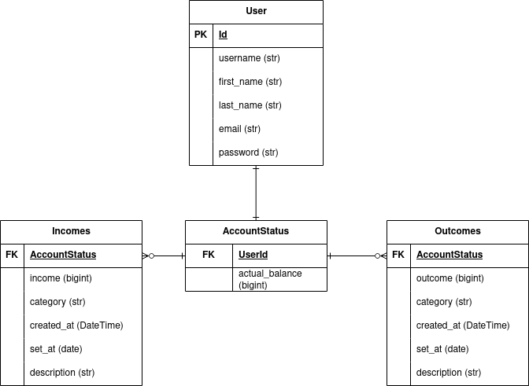

# Financial Web Application

- [Financial Web Application](#financial-web-application)
  - [General use](#general-use)
  - [Setting Up](#setting-up)
  - [Commands](#commands)

This project is a Financial Web Application where you can register your incomes and outcomes, keeping a record of them. For now the application is under development.

In addition, here you can see the db design for the models:



## General use

Don't forget to run the migrations before using the app, you can follow the steps from [Setting up](#setting-up) section. To login with your user you must either go to `http://127.0.0.1:8000/register/` or click the register button from the site `http://127.0.0.1:8000/accounts/login/`.

## Setting Up

To run the app first you must install the requirements using:

```bash
$ pip install -r requirements.txt
```

The app is still in development so you may want to make migrations for the DB, you can use:

```bash
$ python3 manage.py makemigrations
$ python3 manage.py migrate
```

After that process you can run the app using the command:

```bash
$ python3 manage.py runserver
```

## Commands

We created some commands for automatization, here you can see a list of them:

* `set_up_dummy_data`: This command populates the database for the main app with dummy data using factory-boy. Be careful, executing this command will delete all the old data, including superusers, so you may want to create a superuser after executing this command. Ex. of execution:

    ```bash
    $ python3 manage.py set_up_dummy_data
    ```
